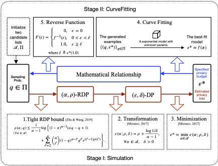
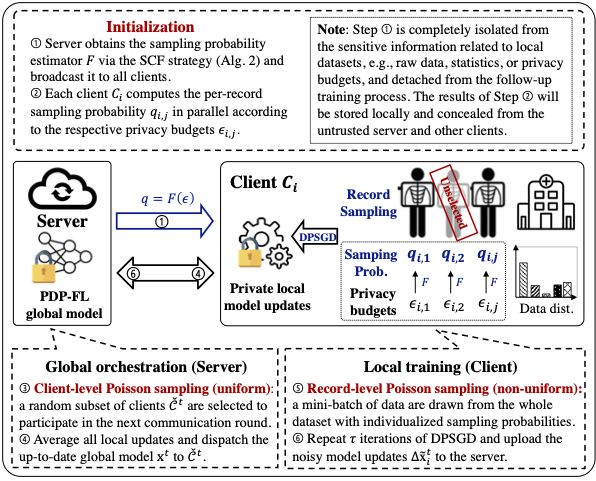

rPDP-FL: 基于记录级个性化差分隐私的跨孤岛联邦学习
本代码库为CCS'24论文《Cross-silo Federated Learning with Record-level Personalized Differential Privacy》的实现。

简介
本开源研究库 myopacus 是对 Opacus 库的扩展，用于在联邦学习框架下使用**记录级个性化差分隐私（rPDP）**训练私有模型。在该框架中，允许每个参与者设置个性化的、非均匀的隐私预算，以反映其个人隐私偏好。

我们设计了一个名为 rPDP-FL 的新框架，采用了两阶段混合采样方案，包括均匀的客户端级采样和非均匀的记录级采样，以适应不同的隐私需求。
其中的一个关键问题是：

在给定个性化隐私预算 ε的情况下，如何选择理想的每条记录采样概率q？

在本工作中，我们引入了一种名为**模拟-曲线拟合（SCF）**的通用解决方案。如下图所示，SCF旨在探索采样概率q与相应的隐私预算 ε之间的数学关系。通过这种方法，我们可以揭示非线性相关性的重要见解，从而在给定预定的隐私预算的情况下推导出每条记录的采样概率。

值得注意的是，rPDP-FL 仅改变了采样过程（除了初始化步骤），并且与学习过程的复杂性无关。这一特性使其能够更广泛地适用于任何包含两阶段采样过程的非私有FL或基于SGD的算法，如下图所示。

实验设置
在本库中，我们模拟了三种潜在的个性化隐私场景（即ThreeLevels、BoundedMixPareto和BoundedMixGauss），并在四个真实世界的数据集上进行了全面评估，包括UCI心脏病数据集、MNIST、CIFAR10和斯坦福自然语言推理（SNLI）语料库。

我们将展示，与现有的集中式机器学习中的PDP方法相比，我们的SCF策略在模型效用和计算效率方面表现更优。此外，我们还证明了rPDP-FL显著提高了联合模型的效用，相较于不包含个性化隐私保护的基线方法。我们CCS论文中展示的所有图表都存储在./assets文件夹中。

快速开始
以下说明适用于支持NVIDIA GeForce RTX 4090 GPU的Ubuntu 22.04 Linux用户。所有实验的模型训练过程均基于CUDA Toolkit 11.8和cuDNN 8.9，使用PyTorch 1.13.1构建。

创建独立的Miniconda环境
首先，请下载并安装适用于您操作系统的最新版Miniconda（Anaconda的简化版本）。

接下来，进入您喜欢的文件夹，然后输入以下命令：

bash
复制
conda create -n rpdp python=3.8
conda activate rpdp
conda install pytorch==1.13.1 torchvision==0.14.1 torchaudio==0.13.1 pytorch-cuda=11.7 -c pytorch -c nvidia
pip install -r requirements.txt
然后将所有依赖模块的路径添加到PYTHONPATH中（如果您以ZIP格式下载此源代码，可以手动或临时添加）。

bash
复制
export PYTHONPATH=$PYTHONPATH:/your/path/rpdp_fl:/your/path/rpdp_fl/myopacus:/your/path/rpdp_fl/torchdp:/your/path/rpdp_fl/experiemnts
运行实验
下载和预处理说明
要生成联邦数据集，用户可以首先进入./experiments/datasets/fed_*/中的dataset_creation_scripts文件夹。例如，要将MNIST数据集拆分为十个独立同分布（IID）的子集，用户可以简单地运行以下命令：

复制
cd /your/path/experiments/datasets/fed_mnist/dataset_creation_scripts
python iid.py
这将自动下载原始的MNIST数据集并完成分区过程。请注意，预处理后的Fed-Heart-Disease数据集已提供在./experiments/datasets/heart_disease文件夹中，以供您使用。

实验配置和结果
我们还在./experiments/configs/文件夹中为不同实验预定义了一些超参数值。

实验的顶层代码
我们论文中展示的实验的顶层代码可以在./experiments/文件夹中找到。例如，为了在联邦学习设置中训练一个在Fed-Heart-Disease数据集上实现记录级个性化差分隐私的私有模型，用户可以运行Python文件fedavg_rpdp.py，如下所示。

bash
复制
cd experiments
# 数据集标志: {"heart_disease", "mnist", "cifar10", "snli"}
python fedavg_rpdp.py --dataset heart_disease --gpuid 0 --seed 42
python fedavg_rpdp.py --dataset snli --gpuid 0 --seed 42
cd
我们提供了每个实验的预计运行时间供您参考：

LogisticRegression-HeartDisease 实验: ~3 计算分钟

DNN+mnist 实验: ~30 计算分钟

ResNet18-cifar10 实验: ~7 计算小时

BERT-SNLI 实验: ~19 计算小时

此外，用户可以运行Python脚本sgd_rpdp.py，在集中式学习设置中训练一个具有rPDP的私有模型。

bash
复制
python sgd_rpdp.py --dataset heart_disease --gpuid 0 --seed 42
我们还提供了fedavg/sgd_vanilla.py和fedavg/sgd_unidp.py，分别实现了普通的FedAvg/SGD算法和DP-FedAvg/DP-SGD算法（其中训练数据集中的所有记录共享相同的隐私预算）作为基线。

实验结果
所有实验结果将保存在./experiments/results/fed_*文件夹中。考虑到实验结果可能会受到系统硬件设置的影响，我们CCS论文中展示的图表的原始结果将保留在./experiments/results/original_submission_results/中供参考。用户可以运行plot_main.ipynb进行数据可视化。

了解更多
RDP & DP预算曲线可视化

为什么选择指数族作为采样概率估计器

如何为具有个性化隐私预算的记录估计个体采样概率

